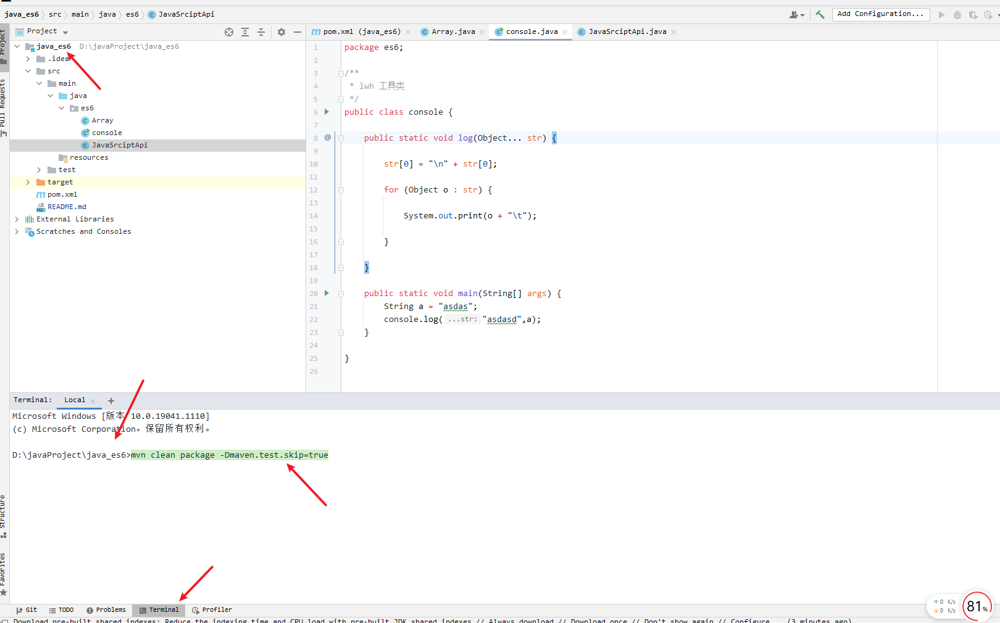
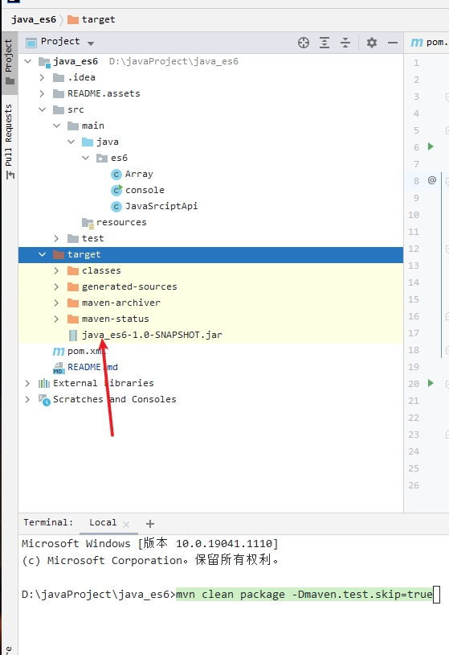
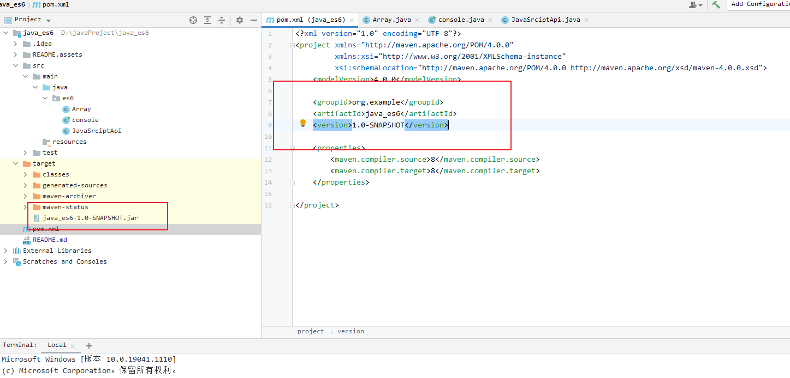
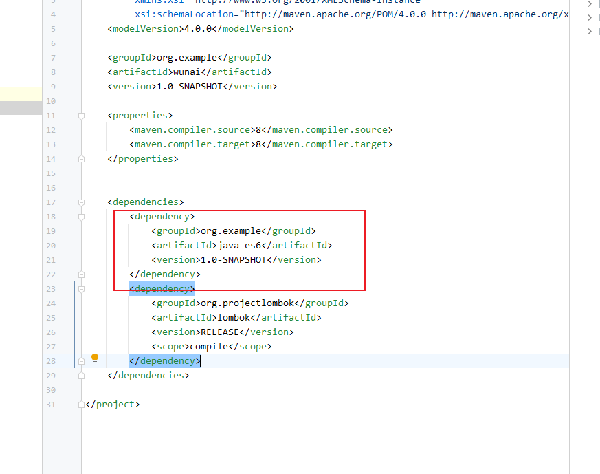
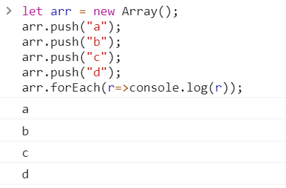
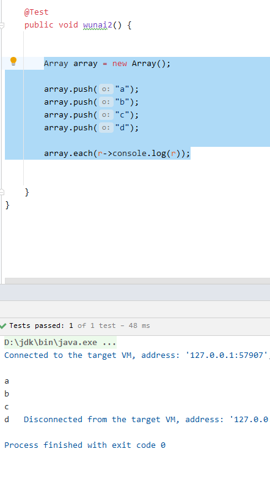

# **用java写es6语法**


# 使用方式Maven模式

## 克隆

```
git clone https://github.com/weihua-git/java_es6.git
```


## 执行打包命令

```
# 跳过测试打包
mvn clean package -Dmaven.test.skip=true
```




## 打包完成在target目录下




## 添加到本地的maven仓库




mvn install:install-file -DgroupId=org.example  

 -DartifactId=java_es6  **图中groupId**

-Dversion=1.0-SNAPSHOT   **图中version**、

-Dfile=D:\javaProject\java_es6\target\java_es6-1.0-SNAPSHOT.jar   **jar包所在位置**

 -Dpackaging=jar

```java
mvn install:install-file -DgroupId=org.example   -DartifactId=java_es6 -Dversion=1.0-SNAPSHOT  -Dfile=D:\javaProject\java_es6\target\java_es6-1.0-SNAPSHOT.jar    -Dpackaging=jar
```


## 导入

和上面一致

```xml
<dependency>
    <groupId>org.example</groupId>
    <artifactId>java_es6</artifactId>
    <version>1.0-SNAPSHOT</version>
</dependency>
```




# 简单模式就是复制文件


# 简单示例


## forEach

javascript

```javascript
let arr = new Array();
arr.push("a");
arr.push("b");
arr.push("c");
arr.push("d");
arr.forEach(r=>console.log(r));
```





java

```java
Array arr = new Array();

arr.push("a");
arr.push("b");
arr.push("c");
arr.push("d");

array.each(r->console.log(r));
```




## filter

java

```java
Array<Integer> arr = new Array();

arr.push(1);
arr.push(2);
arr.push(3);
arr.push(4);

Array<Integer> filter = arr.filter(r -> r > 2);
filter.print();
```

输出

```
内容：	3	
内容：	4	
===================华丽分割线=====================
```


## some

java

```java
Array<Integer> arr = new Array();

arr.push(1);
arr.push(2);
arr.push(3);
arr.push(4);

boolean some = arr.some(r -> r > 2);
```

输出

```
true
```


## find

```java
Array<String> array = new Array();

array.push("a");
array.push("b");
array.push("c");
array.push("d");

String a = array.find(r -> r.equals("b"));
console.log(a);
```


## map

demo

```java
Array<Student> array2 = new Array();

array2.push(new Student(123, "1asdsad", 123));
array2.push(new Student(123, "2asdsad", 123));
array2.push(new Student(123, "3asdsad", 123));
array2.push(new Student(123, "4asdsad", 123));
array2.push(new Student(12312, "5asdsad", 123));


array2.print();

Array<StudentVo> asdad = array2.map((a, b, c) -> new StudentVo(a.getNumber(), a.getName(), a.getScore(), "asdad"));
asdad.print();
```


**完整代码**

```java
import es6.Array;
import es6.console;

public class Demo {


    static class StudentVo {

        private String gradeName; // 年级名称
        private int number;
        private String name;
        private int score;

        public int getNumber() {
            return number;
        }

        public void setNumber(int number) {
            this.number = number;
        }

        public String getName() {
            return name;
        }

        public void setName(String name) {
            this.name = name;
        }

        public int getScore() {
            return score;
        }

        public void setScore(int score) {
            this.score = score;
        }

        public String getGradeName() {
            return gradeName;
        }

        public StudentVo(int number, String name, int score, String gradeName) {
            this.gradeName = gradeName;
            this.number = number;
            this.name = name;
            this.score = score;
        }

        public void setGradeName(String gradeName) {
            this.gradeName = gradeName;
        }

        @Override
        public String toString() {
            return "StudentVo{" +
                    "gradeName='" + gradeName + '\'' +
                    ", number=" + number +
                    ", name='" + name + '\'' +
                    ", score=" + score +
                    '}';
        }
    }


    static class Student{

        private int number;
        private String name;
        private int score;

        public Student(int number, String name, int score) {
            this.number = number;
            this.name = name;
            this.score = score;
        }

        public Student() {
        }

        public int getNumber() {
            return number;
        }

        public String getName() {
            return name;
        }

        public int getScore() {
            return score;
        }

        @Override
        public String toString() {
            return String.format("[%d] %s : %d", getNumber(), getName(), getScore());
        }


    }
    public static void main(String[] args) {

        Array<Student> array2 = new Array();

        array2.push(new Student(123, "1asdsad", 123));
        array2.push(new Student(123, "2asdsad", 123));
        array2.push(new Student(123, "3asdsad", 123));
        array2.push(new Student(123, "4asdsad", 123));
        array2.push(new Student(12312, "5asdsad", 123));


        array2.print();

        Array<StudentVo> asdad = array2.map((a, b, c) -> new StudentVo(a.getNumber(), a.getName(), a.getScore(), "asdad"));
        asdad.print();

    }

}

```

